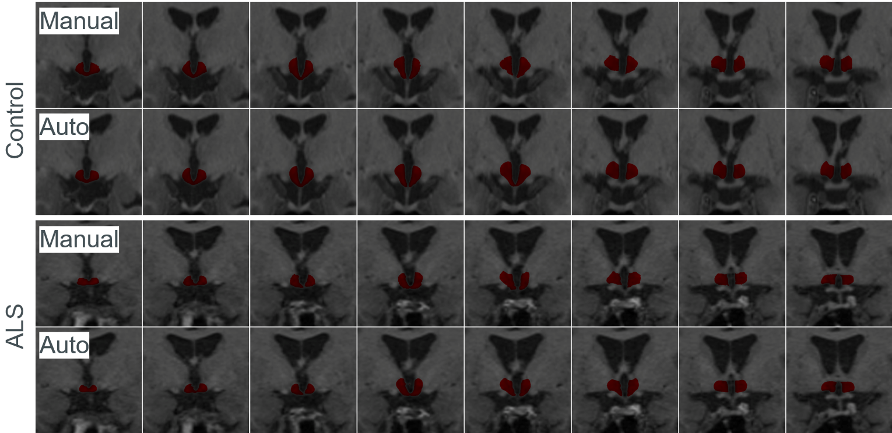

# Hypothalamus segmentation

This repository provides the source code and models for segmentation of the hypothalamus in T1-weighted MR images in coronal orientation at resolution of 0.125x0.125x0.5 mm3 and intracranial volume (ICV) from coronal MRI images of resolution 0.5x0.5x0.5 mm3. The method is based on a convolutional neural network EfficientNetB0, which outputs segmentations of the hypothalamus and ICV.

## Training dataset
During labeling of the data for each patient a folder containing subfolders for each single imaging slice is created. Two files are located in each subfolder: *mri_orig.png* for original MRI image and *mri_hypothal.png* for the manually created segmentation mask. All folders with labeled data are than put into folder named *DATA* which is on the same directory level as the repository. With *generate_data.py* script, the lookup table for training and validation (explicit names are set in the *validation_folders* variable within the script) data is created. As a result, the script creates the folder *metadata_training* with the dataset files shown in the structure below.
Subject folders used for testing should not be stored in the *DATA* folder, since they should not be used in the training.
The training data for ICV are created and stored analogically.

The Figure below illustrates hypothalamus training samples as overlays of the manually segmented masks on high-resolution MRI images.
<p align=center>


## Project structure
```
 
hypothalamus_segmentation
│   README.md
│   network.py
|   generate_data.py
│   my_generator.py
|
└───augmentation
│   │   extend_folder.py
│   │   adjust_contrast.py 
|
└───metadata_training
│   │   partition.npy
│   │   data_set.npy
|
└───validation
│   │   predict.py
|   |   efficientnetb0ICV.h5
|   |   efficientnetb0.h5
│   │   convert2npz.py
|   |   test_folder
|   |   test_folder.npz
|
└───overlay_images
│   │   GT
│   │   MRI
│   │   overlay
│   │   overlay_GT
│   │   overlayMRI
│   │   pred
│   │   overlayGT.py
│   │   overlayMRI.py
|
DATA
└───Folder 1
    | subfolder 1
    ...
    | subfolder m
...
└───Folder n
 ```

 ## Data augmentation
*extend_folder.py* script should be used to respectively increased the number of new folders into which augmented files will be stored. Than *adjust_contrast.py* is used for contrast shifting with some sampled values and creation of new training data.
 
## Training
Training can be started by executing *network.py* file. *my_generator.py* contains the code that is used by the lookup table to load the training samples from the dataset and passes them to the network.

## Ouput models
can be downloaded from [Releases](https://github.com/vernikouskaya/hypothalamus_segmentation/releases/download/v1.0/models.zip)
- models.zip/**efficientnetb0** for hypothalamus segmentation
- models.zip/**efficientnetb0ICV** for intracranial volume segmentation

## Testing
*convert2npz.py* script is used to create test dataset *test_folder.npz* from the subject folder *test_folder* with the same structure as the training dataset.
Then *predict.py* script can be executed for prediction and storing of the files *pridected.png* in the same subfolders as the original test data and calculation of different metrics and number of pixels for each single subject.
 
The Figure below shows two segmentation examples (in coronal slices) obtained for a control subject and a subject diagnosed with Amyothrophic Lateral Sclerosis (ALS) disease.
 <p align=center>


## Additional libraries:
- [Segmentation Models](https://github.com/qubvel/segmentation_models)
- [Surface distance metrics](https://github.com/deepmind/surface-distance)
 
must be installed via:
 ```
  pip install <package name>
 ```
The Figure below illustrates automatically segmented ICV overlayed on original MRI images.
<p align=center>

